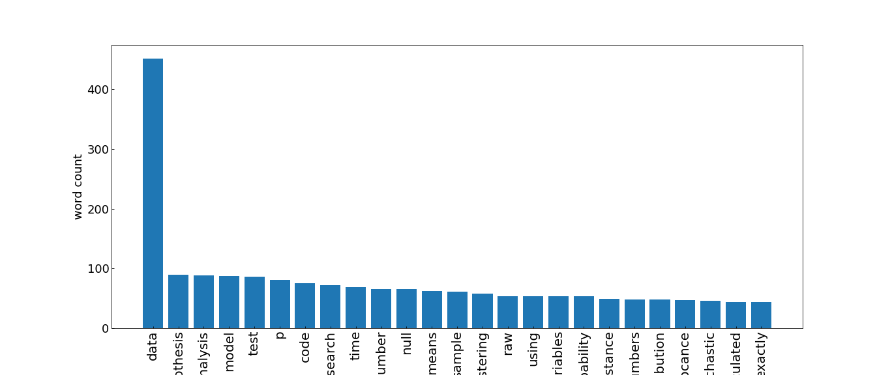
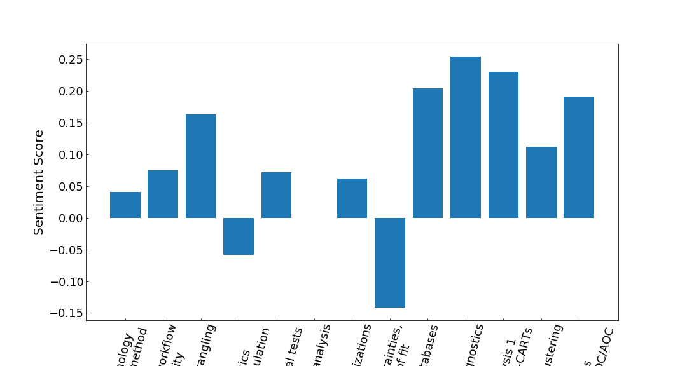

# PUIlexicalAnalysis

lexical analysis of slides from my [PUI lectures](https://github.com/fedhere/UInotebooks)

lexical dispersion plot: the x-axis is the separation in # of words of the words the most common words in my slides, plotted from top to bottom from the most to the least common  - different colors denote different classes, the class topic is at the bottom

I guess I talk a lot about ... data ... ;-)

lecture sentiment: lecture 4, descriptive statistic, I run examples about the effect of children exposure to violence and programs to reintegrate convicts into the job force. And I guess "error" and uncertainty have a negative sentiment score in natural language processing!

