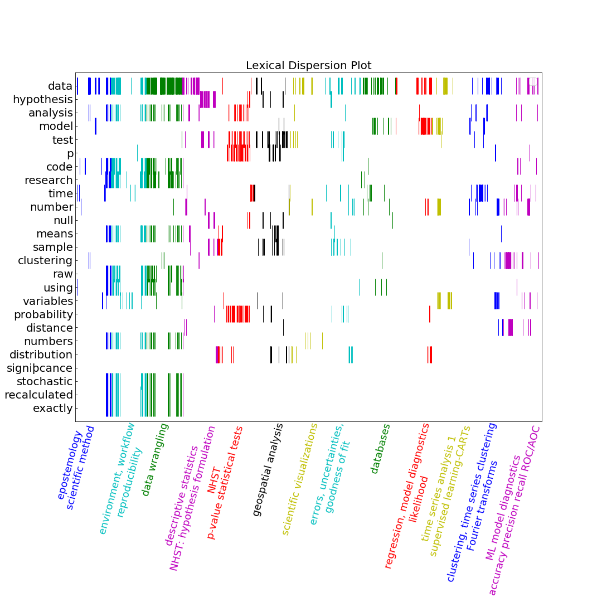

# PUIlexicalAnalysis

lexical analysis of slides from my [PUI lectures](https://github.com/fedhere/UInotebooks)

lexical dispersion plot: the x-axis is the separation in # of words of the words the most common words in my slides, plotted from top to bottom from the most to the least common  - different colors denote different classes, the class topic is at the bottom

